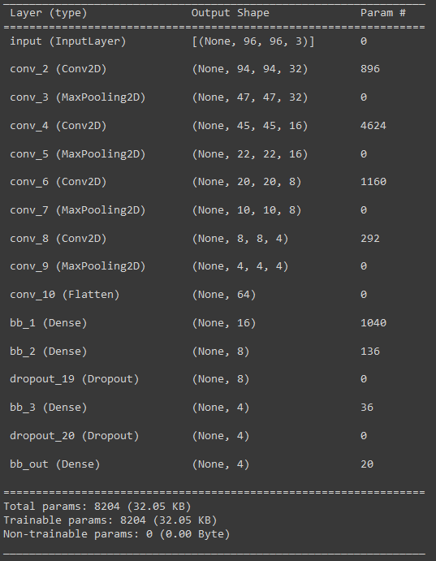
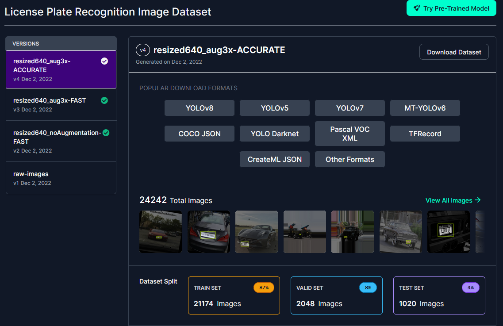
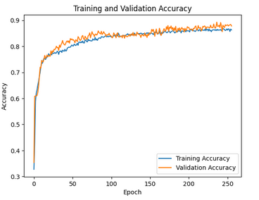
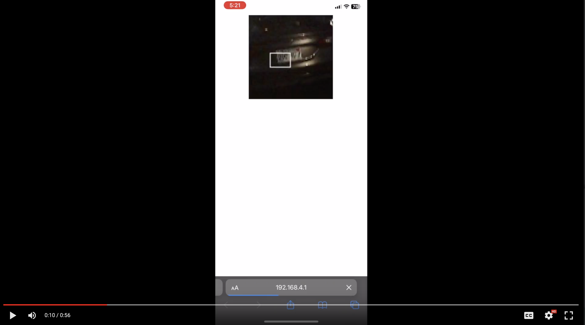

# EECS 700 - Embedded Machine Learning - Final Project

Using Tensorflow Lite, deploy a license plate detection model on the ESP32s3 microcontroller.

## Model Architecture

We use a relatively lightweight model consisting of four convolutional layers and four dense layers. We process our input images as 96x96 RGB565-format, largely due to the resource contraints of training on Google Colab.

## Training Data

Our dataset consists of over 21k YOLO Darknet-annotated images of various vehicle types. This annotation scheme allows the resizing of images to hold no affect on the bounding box coordinates in our testing and deployment. This dataset can be found on [Roboflow](https://universe.roboflow.com/roboflow-universe-projects/license-plate-recognition-rxg4e/dataset/4)

**Yolo Darknet Format**: (x_center, y_center, widht, height) normalized\
**Example**: (0.51015625, 0.4484375, 0.2375, 0.2234375, 96, 96)

## Results

### Training and Validation

At approximately 90% training *and* validation accuracy, we are able to detect license plates, in real time, in most environments. We utilized a low learning rate, 0.0001, and several epochs to stabilize our training which was originally troubled by classic overfitting.

### Deployment

Our model is deployed on the ESP32s3 from [Seeed Studio](https://www.seeedstudio.com/XIAO-ESP32S3-p-5627.html). It is equipped with 8MB of PSRAM and Flash as well as a 240MHZ processor. Our inference time is on average 10 seconds and renders via an HTTP stream, with the bounding box, in approximately 12 second intervals.

### Contributors

[Landen Doty](https://github.com/landoty)\
[Sepehr Noori](https://github.com/sepehrnoory) 